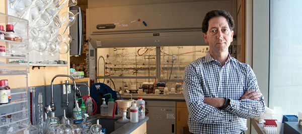

### Our Chair Kevan Shokat is Profiled on www.ucsf.edu for his work with the Ras Protein.

The Ras protein is one of the most common and deadly drivers of cancer, yet it has eluded any drug therapies for decades. Scientists are getting close to changing that. 
<a href="http://www.ucsf.edu/news/2014/06/115356/targeting-key-driver-cancer" target="_blank">Read the full story at ucsf.edu</a>

<a href="http://shokatlab.ucsf.edu/" target="_blank">Kevan's lab</a> studies chemical approaches to deciphering and controlling signal transduction pathways.

Press release: [UCSF](http://www.ucsf.edu/news/2014/06/115356/targeting-key-driver-cancer)